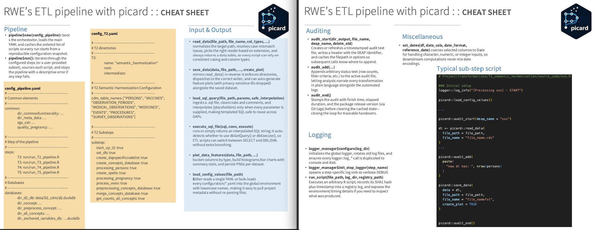

[](https://doi.org/10.5281/zenodo.19554744)

# PICARD: Pipeline Integration and Coordination for Automated R Dataflows <a href="https://github.com/UMC-Utrecht-RWE"></a>

PICARD is an R orchestration package for configuration-driven clinical data pipelines.

It is designed to:
- Run multi-step transformation flows (T2, T3, T4, T5) in a reproducible way.
- Separate orchestration logic from project-specific transformation scripts.
- Provide consistent logging, auditing, and file I/O utilities.

PICARD does not implement project transformations directly. It executes your existing transformation scripts in the order and conditions declared in YAML configuration files.

## Why PICARD

PICARD helps teams keep pipelines reliable while keeping each project flexible:
- Stable orchestration layer in the package.
- Flexible project logic in standalone scripts.
- Config-driven execution for repeatability and traceability.

## Core Concepts

1. A pipeline is configured using YAML files.
2. Each high-level step (T2/T3/T4/T5) contains multiple substeps.
3. Every substep is a plain R script that can run independently.
4. PICARD executes only the substeps marked as enabled in config.

## Main Components

- `pipeline` (R6 class)
  - Loads YAML files.
  - Runs full pipeline steps via `run()`.
  - Runs substeps via `run_substeps()`.
  - Optionally skips completed substeps with `skip_step()`.

- `t2_pipeline`, `t3_pipeline`, `t4_pipeline`, `t5_pipeline` (R6 classes)
  - Step-specific wrappers that load step configs and execute configured substeps.

- I/O layer
  - `load()` and `save()` provide extension-based readers/writers.
  - `register_reader()` / `register_writer()` allow custom formats.
  - `list_readers()` / `list_writers()` show available formats.

- SQL helpers
  - `load_sql_query()` reads SQL files.
  - `execute_sql_file()` safely quotes `{identifier}` placeholders and binds
    `?` value parameters through DBI.

- Audit and logging
  - `audit_start()`, `audit_add()`, `audit_end()` for human-readable audit files.
  - `LoggerManager` for structured run and step logging.

## Installation

```r
pak::pkg_install("github::UMC-Utrecht-RWE/picard@main")
# or
remotes::install_github("UMC-Utrecht-RWE/picard", ref = "main")
```

If the repository is private, authenticate R to GitHub first:

```r
install.packages(c("usethis", "gitcreds", "gh"))
usethis::create_github_token()
gitcreds::gitcreds_set()
gh::gh_whoami()
```

## Quick Start

```r
library(picard)

# 1) Full pipeline execution from a master pipeline config
pl <- picard::pipeline$new("configuration/config_pipeline.yaml")
pl$run()

# 2) Run only selected top-level steps
pl$run(step_subset = c("T2", "T3"))
```

To run one step class directly (example: T2):

```r
t2 <- picard::t2_pipeline$new(
  config_t2 = "configuration/config_T2.yaml",
  config_project = "configuration/config_project.yaml",
  skip_substeps = TRUE
)
t2$run()
```

## Minimal Configuration Pattern

At minimum, a step config must define:
- a top-level section for the step key (`T2`, `T3`, ...), and
- a sibling `substep` list with booleans.

Example (`config_T2.yaml`):

```yaml
T2:
  root: "/path/to/project"
  source_code: "transformations/T2"

substep:
  import_source: true
  map_codes: true
  derive_outcomes: false
```

With this config, PICARD executes:
- `/path/to/project/transformations/T2/import_source.R`
- `/path/to/project/transformations/T2/map_codes.R`

and skips `derive_outcomes.R`.

## Data I/O API

PICARD includes extension-based readers and writers.

Built-in readers typically include: `csv`, `duckdb`, `fst`, `parquet`, `rdata`, `rds`, `xlsx`.

Built-in writers typically include: `csv`, `fst`, `parquet`, `rdata`, `rds`, `txt`, `xlsx`.

```r
# Load any supported file type
dt <- picard::load("data/input.csv")

# Save to any supported file type
picard::save(dt, "data/output.parquet")

# See available handlers
picard::list_readers()
picard::list_writers()
```

## SQL Helpers

```r
sql <- picard::load_sql_query(
  file_path = "sql/my_query.sql"
)

result <- picard::execute_sql_file(
  sql = sql,
  conn = con,
  identifiers = list(schema = "main", table = "patients"),
  params = list(18)
)
```

## Audit Example

```r
picard::audit_start(dir_output = "data/audits", file_name = "t2_import")
picard::audit_add("Rows before filter: ", nrow(dt_before))
picard::audit_add("Rows after filter: ", nrow(dt_after))
picard::audit_end()
```

## Tutorial

A full, step-by-step tutorial is available in [TUTORIAL.md](TUTORIAL.md), including:
- project folder structure,
- YAML templates,
- substep script examples,
- end-to-end run sequence,
- troubleshooting checklist.

## Cheatsheet

<a href="man/cheatsheet/picard.pdf"></a>

## Governance and Security

PICARD aligns with UMC Utrecht and VAC4EU data governance principles:
- Designed for secure research environments.
- Supports transparent and auditable execution.
- Promotes reproducibility through externalized configuration.

Make it run.
