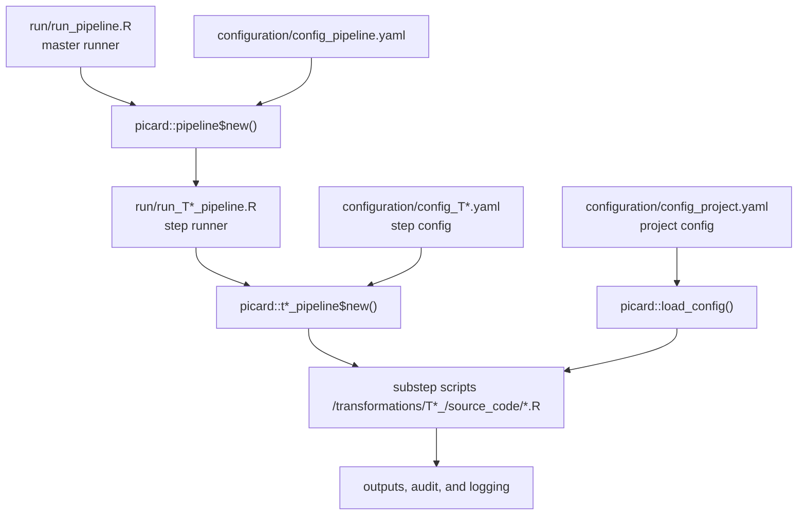

# PICARD Tutorial

This tutorial shows how to structure a project around PICARD.

Terminology used in this tutorial:

- A `pipeline` is the full orchestrated run across one or more top-level
  steps.
- A `step` is one top-level stage such as `T2`, `T3`, `T4`, or `T5`.
- A `substep` is a plain R script inside a step, such as `set_db.R`.
- A `master runner` is the script that starts the full pipeline.
- A `step runner` is the script that starts one step.
- `audit` means human-readable records written during execution.
- `logging` means structured run and step messages written by
  `LoggerManager`.

This tutorial shows how those pieces fit together:

- a master runner in `run/`,
- YAML files for pipeline, step, and project configuration,
- one step runner per step (`T2`, `T3`, `T4`, `T5`),
- substep scripts stored under `transformations/<step>/source_code`,
- shared functions and shared configuration outside the package,
- and substeps that use PICARD for orchestration, config loading, I/O, SQL,
  audit, and logging.

## 1. Recommended Project Layout

This is the layout to aim for:

```text
my_project/
  configuration/
    config_pipeline.yaml
    config_project.yaml
    config_T2.yaml
    config_T3.yaml
    config_T4.yaml
    config_T5.yaml
    config_values.yaml
  run/
    run_pipeline.R
    run_T2_pipeline.R
    run_T3_pipeline.R
    run_T4_pipeline.R
    run_T5_pipeline.R
  transformations/
    common_functionality/
      functions/
    common_configuration/
      RWE-BRIDGE/
      meta_data/
    T2_semantic_harmonization/
      source_code/
        functions/
        sql/
        set_db.R
        process_codelist.R
        processing_persons.R
      intermediate_data_file/
    T3_cohort_building/
      source_code/
      intermediate_data_file/
    T4_analytic_dataset/
      source_code/
      intermediate_data_file/
    T5_reporting/
      source_code/
      intermediate_data_file/
  data/
    D2_cdm/
    D3_study_variables/
    D4_analytic_datasets/
    D5_results/
    D6_report/
  logs/
```

Notes:

- PICARD only requires a few keys to run a step, but projects usually keep
  much richer configuration next to those required keys.
- The step engine resolves substep scripts from
  `<root>/<source_code>/<substep>.R`.
- Shared study assets usually live in `transformations/common_configuration/`
  and shared helper code in `transformations/common_functionality/`.

## 2. How PICARD Resolves Your Project

PICARD uses three layers of configuration in a typical project:

1. `config_pipeline.yaml`
   This is the master orchestration file. It tells `pipeline$new()` which step
   runner to source for `T2`, `T3`, `T4`, and `T5`.
2. `config_T2.yaml`, `config_T3.yaml`, ...
   Each step file tells a step class where its root folder and source scripts
   are, and which substeps are enabled.
3. `config_project.yaml`
   This holds project-specific inputs, outputs, database paths, and study
   settings that the sourced scripts use directly.

The relationships between those files and the execution flow look like this:



`picard::load_config()` is what makes those YAML files available inside the
scripts. It loads all `.yaml` files from `configuration/` into the global
environment using lowercase object names derived from the file names:

- `config_pipeline.yaml` -> `config_pipeline`
- `config_T2.yaml` -> `config_t2`
- `config_project.yaml` -> `config_project`
- `config_values.yaml` -> `config_values`

That is why scripts in projects we can call
`config_t2$T2$root` or `config_project$DEAP_configuration$name` after a single
call to `picard::load_config()`.

## 3. Create the Master Pipeline Config

Create `configuration/config_pipeline.yaml`:

```yaml
common:
  dir_commonfunctionality: transformations/common_functionality
  dir_function: transformations/common_functionality/functions
  dir_bridge: transformations/common_configuration/RWE-BRIDGE
  dir_meta_data: transformations/common_configuration/meta_data

steps:
  T2: run/run_T2_pipeline.R
  T3: run/run_T3_pipeline.R
  T4: run/run_T4_pipeline.R
  T5: run/run_T5_pipeline.R

databases:
  dir_d2_db: data/D2_cdm/d2.duckdb
  dir_concept: data/D3_study_variables/D3_CONCEPTS.duckdb
  dir_all_concepts: data/D3_study_variables/D3_ALL_CONCEPTS.duckdb
```

Only `steps:` is required by the master pipeline engine. The `common:` and
`databases:` sections are project-defined, but they are a useful pattern
because every sourced script can read them through `config_pipeline`.

## 4. Create a Step Config

Create `configuration/config_T2.yaml`:

```yaml
T2:
  name: semantic_harmonization
  root: transformations/T2_semantic_harmonization
  intermediate: intermediate_data_file
  config: configuration
  source_code: source_code
  sql_queries: source_code/sql
  functions: source_code/functions

cleanup:
  intermediate_data_file: true

substep:
  set_db: true
  process_codelist: true
  processing_persons: true
  create_simple_concepts: false

cdm_table_names:
  - PERSONS
  - MEDICINES
  - EVENTS
```

What PICARD itself needs here is small:

- `T2.root`
- `T2.source_code`
- `substep`

Everything else is available to your scripts as plain configuration data.

With the file above, `t2_pipeline$run()` will look for:

- `transformations/T2_semantic_harmonization/source_code/set_db.R`
- `transformations/T2_semantic_harmonization/source_code/process_codelist.R`
- `transformations/T2_semantic_harmonization/source_code/processing_persons.R`

and skip `create_simple_concepts.R`.

## 5. Create the Project Config

Create `configuration/config_project.yaml`:

```yaml
DEAP_configuration:
  name: xxx
  data_instance: data/D2_cdm/xxx_20260423
  database_path: ~

set_db:
  cdm_metadata: transformations/common_configuration/CDM_metadata.rds
  database_loader_config: configuration/config_set_db.json
  output: data/D2_cdm/d2.duckdb

process_codelist:
  events_codelist_latest: transformations/common_configuration/RWE-BRIDGE/events.csv
  medicines_codelist_latest: transformations/common_configuration/RWE-BRIDGE/medicines.csv
  output_codelist_events: transformations/T2_semantic_harmonization/intermediate_data_file/dap_specific_codelist_events.rds
  output_codelist_medicines: transformations/T2_semantic_harmonization/intermediate_data_file/dap_specific_codelist_medicines.rds

processing_persons:
  persons: data/D2_cdm/d2.duckdb
  output_persons: data/D3_study_variables/D3_PERSONS.parquet

outputs:
  dir_d3: data/D3_study_variables
  dir_d4: data/D4_analytic_datasets
  dir_d5: data/D5_results
  dir_d6: data/D6_report
```

This file is not interpreted by PICARD beyond the optional skip logic described
below. Its main job is to give your sourced scripts stable paths and settings.

## 6. Create the Master Runner

Create `run/run_pipeline.R`:

```r
#!/usr/bin/env Rscript

lm <- picard::LoggerManager$new()
lm$configure(log_dir = "logs", verbose = "Normal")

pipeline <- picard::pipeline$new(
  config_pipeline = "configuration/config_pipeline.yaml"
)

picard::load_config()
pipeline$run()
```

What this does:

- configures the run logger,
- instantiates the master pipeline,
- loads all YAML files into objects such as `config_pipeline` and
  `config_project`,
- then sources each configured step runner in order.

## 7. Create a Step Runner

Create `run/run_T2_pipeline.R`:

```r
#!/usr/bin/env Rscript

if (
  !base::exists("lm", inherits = TRUE) ||
    !base::inherits(lm, "LoggerManager")
) {
  lm <- picard::LoggerManager$new()
  lm$configure(log_dir = "logs", verbose = "Normal")
}

lm$start_step_logger("T2")
on.exit(lm$end_step_logger(), add = TRUE)

pipeline <- picard::t2_pipeline$new(
  config_t2 = "configuration/config_T2.yaml",
  config_project = "configuration/config_project.yaml",
  skip_substeps = TRUE
)

# Optional: call pipeline$clean() if you want to clear the T2 intermediate
# folder before the run and cleanup.intermediate_data_file is true.

pipeline$run()
```

This is slightly more robust than the bare project runner pattern because it
works both:

- when sourced by `run_pipeline.R`, and
- when executed directly for T2-only development.

For `T3`, `T4`, and `T5`, use the same runner pattern but instantiate the
matching class with only its step config, for example
`picard::t3_pipeline$new(config_t3 = "configuration/config_T3.yaml")`.

## 8. Write a Substep Script

Create
`transformations/T2_semantic_harmonization/source_code/processing_persons.R`:

```r
if (
  !base::exists("lm", inherits = TRUE) ||
    !base::inherits(lm, "LoggerManager")
) {
  lm <- NULL
}

if (!base::is.null(lm)) {
  lm$start_script("processing_persons.R")
  lm$start_capturing_prints()
}

picard::load_config()

picard::audit_start(
  file_name = "d3_persons",
  deap_name = config_project$DEAP_configuration$name
)

dir_d2_db <- config_pipeline$databases$dir_d2_db
output_path <- config_project$processing_persons$output_persons

...
...
...

picard::save(persons, output_path)

picard::audit_add("Rows exported: ", nrow(persons))
picard::audit_end()

if (!base::is.null(lm)) {
  lm$stop_capturing_prints()
  lm$end_script()
}
```

This is the core PICARD script pattern:

- guard access to the logger so the script can run inside or outside a full
  pipeline run,
- call `picard::load_config()` up front,
- take all paths from config objects,
- use PICARD helpers for audit and file I/O,
- keep the actual transformation logic in plain R.

## 9. Run the Full Pipeline

In R:

```r
pl <- picard::pipeline$new("configuration/config_pipeline.yaml")
picard::load_config()
pl$run()
```

Run only selected top-level steps:

```r
pl$run(step_subset = c("T2", "T4"))
```

Run only T2:

```r
t2 <- picard::t2_pipeline$new(
  config_t2 = "configuration/config_T2.yaml",
  config_project = "configuration/config_project.yaml",
  skip_substeps = TRUE
)
t2$run()
```

## 10. How `skip_substeps` Works

Today `skip_substeps` is implemented on `t2_pipeline$new(...)`.

`skip_substeps = TRUE` is useful when you want a rerun to pick up where a
previous run left off.

The rule is exact:

- PICARD looks at each name in `substep:`.
- If the same name exists in `config_project.yaml`,
- and every field starting with `output` exists on disk,
- then that substep is switched from `true` to `false` before execution.

Example:

```yaml
process_codelist:
  output_codelist_events: transformations/T2_semantic_harmonization/intermediate_data_file/dap_specific_codelist_events.rds
  output_codelist_medicines: transformations/T2_semantic_harmonization/intermediate_data_file/dap_specific_codelist_medicines.rds
```

If both files exist, `process_codelist` is skipped.

This is why it is worth naming output paths consistently in
`config_project.yaml`.

## 11. Use SQL Helpers Inside a Substep

Projects keep SQL files under `source_code/sql/`. PICARD works well with that pattern.

Example:

```r
picard::load_config()

sql_path <- file.path(
  config_t2$T2$root,
  config_t2$T2$sql_queries,
  "load_persons.sql"
)

sql <- picard::load_sql_query(
  file_path = sql_path,
  params = list(schema = "main", table = "PERSONS")
)

con <- DBI::dbConnect(duckdb::duckdb(), config_pipeline$databases$dir_d2_db)
on.exit(DBI::dbDisconnect(con, shutdown = TRUE), add = TRUE)

persons <- picard::execute_sql_file(sql = sql, conn = con)
```

Use SQL files for reusable extracts and keep R scripts focused on orchestration
and post-processing.

## 12. Use PICARD I/O Utilities

PICARD resolves readers and writers by file extension.

```r
# Current API
persons <- picard::load("data/D3_study_variables/D3_PERSONS.parquet")
picard::save(persons, "data/D5_results/person_summary.csv")

# Inspect available handlers
picard::list_readers()
picard::list_writers()
```

Important:

- older projects may still use `picard::read_data()` and `picard::save_data()`,
- those wrappers are deprecated,
- prefer `picard::load()` and `picard::save()` in new code and new tutorials.

## 13. Auditing and Logging

The common project pattern is:

- `LoggerManager` is configured once in the master runner
```r
lm <- picard:::LoggerManager$new()
lm$configure(verbose = "Normal") # Low or High
logger::log_info("Message")
```
- step runners call `start_step_logger("T2")`, `start_step_logger("T3")`, ...
- substeps call `start_script()` and optionally capture printed output
- Logger produces two types of log files in the `logs` folder: A *main one* that has all log messages from all steps. And a second kind a *step one* that is contained in sub-folder of `logs`, with all log messages and **print messages/message from other packages**. If you code fails it is good practice to investigate these step logs.
- `audit_start()` / `audit_add()` / `audit_end()` create a human-readable audit
  trail next to the data outputs.

Minimal audit example:

```r
picard::audit_start(
  dir_output = "data/audits",
  file_name = "process_codelist",
  deap_name = config_project$DEAP_configuration$name
)
picard::audit_add("Rows before deduplication: ", nrow(dt_before))
picard::audit_add("Rows after deduplication: ", nrow(dt_after))
picard::audit_end()
```

## 14. Cleanup

PICARD exposes two cleanup patterns.

Generic folder cleanup:

```r
pl <- picard::pipeline$new("configuration/config_pipeline.yaml")
pl$clean(content_to_delete = "transformations/T2_semantic_harmonization/intermediate_data_file")
```

Step-specific cleanup:

```r
t2 <- picard::t2_pipeline$new(
  config_t2 = "configuration/config_T2.yaml",
  config_project = "configuration/config_project.yaml"
)
t2$clean()
```

For `t2$clean()` to remove the intermediate folder contents, this must be set:

```yaml
cleanup:
  intermediate_data_file: true
```

Use cleanup carefully. It deletes files inside the configured folder.

## 15. Troubleshooting

- `Missing configuration file`
  Check that you are running from the repository root and that the YAML path in
  the runner is correct.
- `Missing section in config: T2`
  Ensure the step config has a top-level `T2:` section.
- `Missing 'substep' section in config`
  Ensure the step config defines `substep:` with booleans.
- `object 'config_t2' not found`
  Your script uses config objects before calling `picard::load_config()`.
- `cannot open file '<substep>.R'`
  PICARD is looking for `<T2.root>/<T2.source_code>/<substep>.R`. The substep
  name in YAML must match the file name exactly.
- A substep was skipped unexpectedly
  If `skip_substeps = TRUE`, check whether all `output*` paths for that substep
  already exist in `config_project.yaml`.
- Logs are missing for a standalone step run
  Instantiate `LoggerManager` in the step runner when `lm` does not already
  exist.
- `read_data()` or `save_data()` warns about deprecation
  Switch the script to `load()` and `save()`.

## 16. Recommended Pattern

If you follow the style, keep these boundaries clear:

- PICARD owns orchestration, logging, audit, config loading, and generic I/O.
- The study repository owns path conventions, DuckDB queries, transformation
  logic, and study-specific YAML keys.
- Step configs should stay simple and explicit.
- `config_project.yaml` should be the single source of truth for study inputs
  and outputs.

Make the pipeline easy to rerun, easy to inspect, and easy to source one step
at a time.
